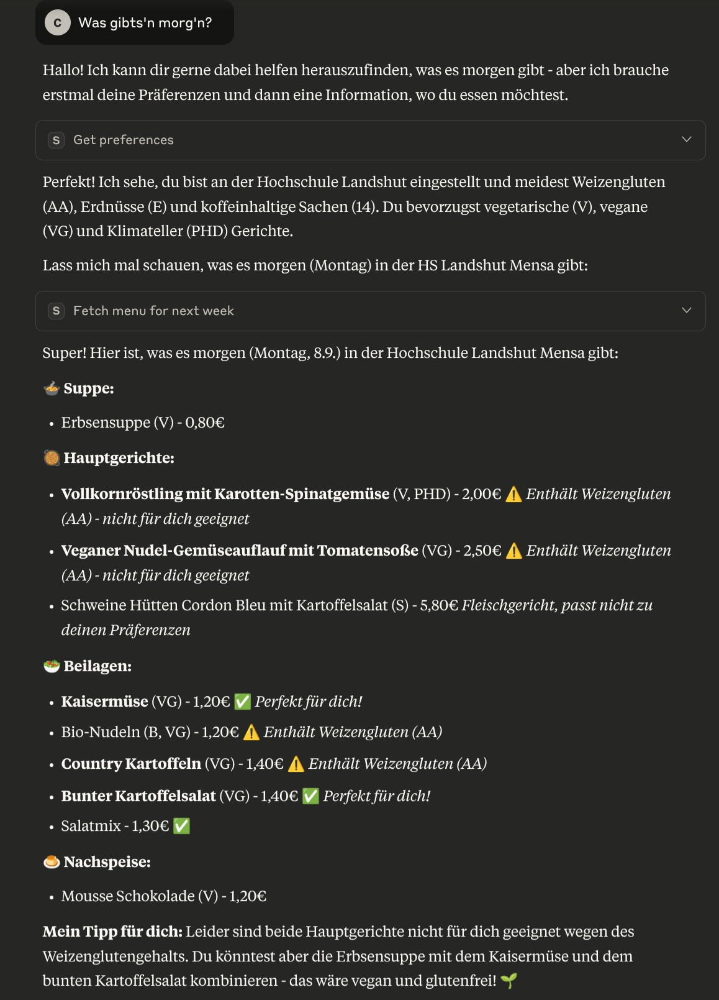

# Wos gibt'sn heid? MCP Server



Ein Claude MCP (Model Context Protocol) Tool, das einfachen Zugriff auf die Mensaspeisepläne des [Studierendenwerks Niederbayern/Ostbayern](https:://www.stwno.de) ermöglicht:

- unterstützt alle Mensen und Cafeterien des StWNOs
- Anzeigen von Speiseplänen für die aktuelle Woche, kommende Wochen oder eine beliebige Kalenderwoche
- ermöglicht das Filtern nach Inhaltsstoffen und Allergenen
- berücksichtigt bevorzugte Kennzeichnungen (vegetarisch, vegan, Rind, etc.)
- nutzbar von allen MCP clients (aktuell getestet mit Claude Desktop und OpenCode)

Der Name *wos gibts'n heid* ist bayerischer Dialekt für "Was gibt es heute?".

## Haftungsausschluss

**WICHTIG:**
- Dieses Projekt ist in keiner Weise mit dem Studierendenwerk Niederbayern/Ostbayern (StWNO) oder einem seiner Partner verbunden.
- LLMs und dieses Tool können Fehler machen. Benutzern wird dringend empfohlen, Allergene, Inhaltsstoffe und Kennzeichnungen selbst zu überprüfen und bei Bedarf das StWNO-Personal zu fragen.
- Die von diesem Tool bereitgestellten Informationen sollten nicht allein für Ernährungseinschränkungen oder Allergiebedenken herangezogen werden.

## Installation

### Claude Desktop: MCPB Paket (empfohlen)

Dieses Tool ist als MCPB (MCP Bundle) Paket verfügbar:

1. Laden Sie das neueste `.mcpb` Paket von der [GitHub-Releases-Seite](https://github.com/christo-auer/mcp-wos-gibtsn-heid/releases) herunter
2. In Claude Desktop: *Einstellungen*, *Erweiterungen*, *Erweiterte Einstellungen*, *Erweiterung installieren*, MCPB-Bundle auswählen, *Installieren* und bestätigen
3. *Konfigurieren* und Dialog schließen: Die Konfigurationsoptionen sind unten aufgelistet. Speichern nicht vergessen
4. Das Tool ist danach einsatzbereit. 

Das MCPB-Paket enthält alle plattformspezifischen Binärdateien und eine benutzerfreundliche Konfigurationsoberfläche für alle verfügbaren Optionen.

### Claude Desktop: JSON-Konfiguration

Laden Sie dass passende Paket für Ihr Betriebssystem herunter: [GitHub-Releases-Seite](https://github.com/christo-auer/mcp-wos-gibtsn-heid/releases)  und verwenden Sie folgende Ausschnitt um Claude Desktop zu konfigurieren

```json

{
    "mcpServers": {
        "mcp-wos-gibtsn-heid": {
            "args": [
                "--location",
                "", // auf gewünschten Standort ändern, z.B., hs-la
                "--avoid-allergens",
                "", // zu vermeidende Allergene hier eintragen, z.B., AA,AB
                "--preferred-indicators",
                ")", // bevorzugte Kennzeichnungen hier eintragen, z.B., V,VG,PHD
                "--avoid-ingredients",
                "" // zu vermeidende Allergene hier eintragen z.B., 0,1,4
            ],
            "command": "/pfad/zu/mcp-wos-gibtsn-heid"
        },

    }

}
```

### Andere Clients

Sollte der Client MCPB (MCP Bundles) unterstützen, dann dieses verwenden. Ansonsten die neueste Version der Binärdatei für Ihr Betriebssystem von der [GitHub-Releases-Seite](https://github.com/christo-auer/wos-gibtsn-heid/releases) herunterladen und vom MCP-Server direkt ausführen lassen. Das Tool kann über Kommandozeilenparameter (siehe unten), konfiguriert werden.

### Aus dem Quellcode bauen

Wenn Sie das Tool aus dem Quellcode bauen möchten:

1. Stellen Sie sicher, dass Rust und Cargo installiert sind
2. Klonen Sie das Repository
3. Cargo ausführen
   ```
   cargo build --release
   ```
4. Die Binärdatei liegt unter `target/release/mcp-wos-gibtsn-heid`

## Verwendung

### Parameter

```
mcp-wos-gibtsn-heid [OPTIONEN]
```

#### Optionen:

| Option                                        | Beschreibung                                                    | Mögliche Werte                                               |
|--------                                       |-------------                                                    |----------------                                              |
| `--location <LOCATION>`                       | Standardort, für den der Speiseplan abgerufen werden soll       | Siehe [Standorte](#standorte)                                |
| `--avoid-allergens <LIST-OF-ALLERGENES>`      | Durch Kommas getrennte Liste von zu vermeidenden Allergenen     | Beispiel: `AA,E,L` (Siehe [Allergene](#allergene))           |
| `--avoid-ingredients <LIST-OF-INGREDIENTS>`   | Durch Kommas getrennte Liste von zu vermeidenden Inhaltsstoffen | Beispiel: `1,4,2` (Siehe [Inhaltsstoffe](#inhaltsstoffe))    |
| `--preferred-indicators <LIST-OF-INDICATORS>` | Durch Kommas getrennte Liste bevorzugter Kennzeichnungen        | Beispiel: `V,VG` (Siehe [Kennzeichnungen](#kennzeichnungen)) |
| `--list locations`                            | Verfügbare Standorte auflisten                                  |                                                              |
| `--list allergens`                            | Verfügbare Allergene auflisten                                  |                                                              |
| `--list ingredients`                          | Verfügbare Inhaltsstoffe auflisten                              |                                                              |
| `--list indicators`                           | Verfügbare Kennzeichnungen auflisten                            |                                                              |
| `--help`                                      | Hilfe anzeigen                                                  |                                                              |
| `--version`                                   | Version anzeigen                                                |                                                              |

#### Beispiel:

```bash
# Einstellungen für vegetarisches Essen an der OTH Regensburg (Mittagsgerichte), unter Vermeidung von Allergenen aus Eiern und Laktose
mcp-wos-gibtsn-heid --location HS-R-tag --preferred-indicators V,VG --avoid-allergens C,G

# Alle verfügbaren Standorte auflisten
mcp-wos-gibtsn-heid --list-locations
```

## Standorte

Die folgenden Standorte werden unterstützt:

| Standort-Code              | Beschreibung                                     |
|--------------              |-------------                                     |
| `HS-LA`                    | Hochschule Landshut Mensa                        |
| `HS-LA-Cafeteria`          | Hochschule Landshut Cafeteria                    |
| `UNI-R`                    | Universität Regensburg Mensa                     |
| `UNI-R-Gs`                 | Universität Regensburg Mensa - Gästesaal         |
| `Cafeteria-PT`             | Universität Regensburg Cafeteria PT              |
| `Cafeteria-Chemie`         | Universität Regensburg Cafeteria Chemie          |
| `Cafeteria-Sammelgebaeude` | Universität Regensburg Cafeteria Sammelgebäude   |
| `Cafeteria-Sport`          | Universität Regensburg Cafeteria Sport           |
| `HS-R-tag`                 | OTH Regensburg Mensa Seybothstraße (Mittags)     |
| `HS-R-abend`               | OTH Regensburg Mensa Seybothstraße (Abends)      |
| `Cafeteria-Pruefening`     | OTH Regensburg Mensa Prüfeningerstraße (Mittags) |
| `UNI-P`                    | Universität Passau Mensa                         |
| `Cafeteria-Nikolakloster`  | Universität Passau Cafeteria Nikolakloster       |
| `HS-DEG`                   | TH Deggendorf Mensa                              |
| `TH-DEG-Cham`              | TH Deggendorf-Cham                               |
| `HS-PAN`                   | European Campus Pfarrkirchen                     |
| `HS-SR`                    | TUM Campus Straubing                             |

## Allergene, Inhaltsstoffe und Kennzeichnungen

### Allergene

| Code | Beschreibung               |
|------|-------------               |
| `AA` | Weizengluten               |
| `AB` | Roggengluten               |
| `AC` | Gerstengluten              |
| `AD` | Hafergluten                |
| `AE` | Dinkelgluten               |
| `AF` | Kamutgluten                |
| `B`  | Krebstiere                 |
| `C`  | Eier                       |
| `D`  | Fisch                      |
| `E`  | Erdnüsse                   |
| `F`  | Soja                       |
| `G`  | Milch und Milchprodukte    |
| `HA` | Mandel                     |
| `HB` | Haselnuss                  |
| `HC` | Walnuss                    |
| `HD` | Cashew                     |
| `HE` | Pecannuss                  |
| `HF` | Paranuss                   |
| `HG` | Pistazie                   |
| `HH` | Macadamianuss              |
| `HI` | Queenslandnuss             |
| `I`  | Sellerie                   |
| `J`  | Senf                       |
| `K`  | Sesamsamen                 |
| `L`  | Schwefeldioxid und Sulfite |
| `M`  | Lupinen                    |
| `N`  | Weichtiere                 |
| `O`  | Nitrat                     |
| `P`  | Nitritpökelsalz            |

### Inhaltsstoffe

| Code | Beschreibung                                          |
|------|-------------                                          |
| `1`  | mit Farbstoff                                         |
| `2`  | mit Konservierungsstoff                               |
| `3`  | mit Antioxidationsmittel                              |
| `4`  | mit Geschmacksverstärker                              |
| `5`  | geschwefelt                                           |
| `6`  | geschwärzt                                            |
| `7`  | gewachst                                              |
| `8`  | mit Phosphat                                          |
| `9`  | mit Süssungsmittel Saccharin                          |
| `10` | mit Süssungsmittel Aspartam, enth. Phenylalaninquelle |
| `11` | mit Süssungsmittel Cyclamat                           |
| `12` | mit Süssungsmittel Acesulfam                          |
| `13` | chininhaltig                                          |
| `14` | coffeinhaltig                                         |
| `16` | enthält Sulfite                                       |
| `17` | enthält Phenylalanin                                  |

### Kennzeichnungen

| Code  | Beschreibung                        |
|------ |-------------                        |
| `V`   | vegetarisch                         |
| `VG`  | vegan                               |
| `S`   | Schwein                             |
| `R`   | Rind                                |
| `G`   | Geflügel                            |
| `F`   | Fisch                               |
| `A`   | Alkohol                             |
| `B`   | bio                                 |
| `PHD` | Klimateller (planetary health diet) |

## Lizenz

MIT-Lizenz

